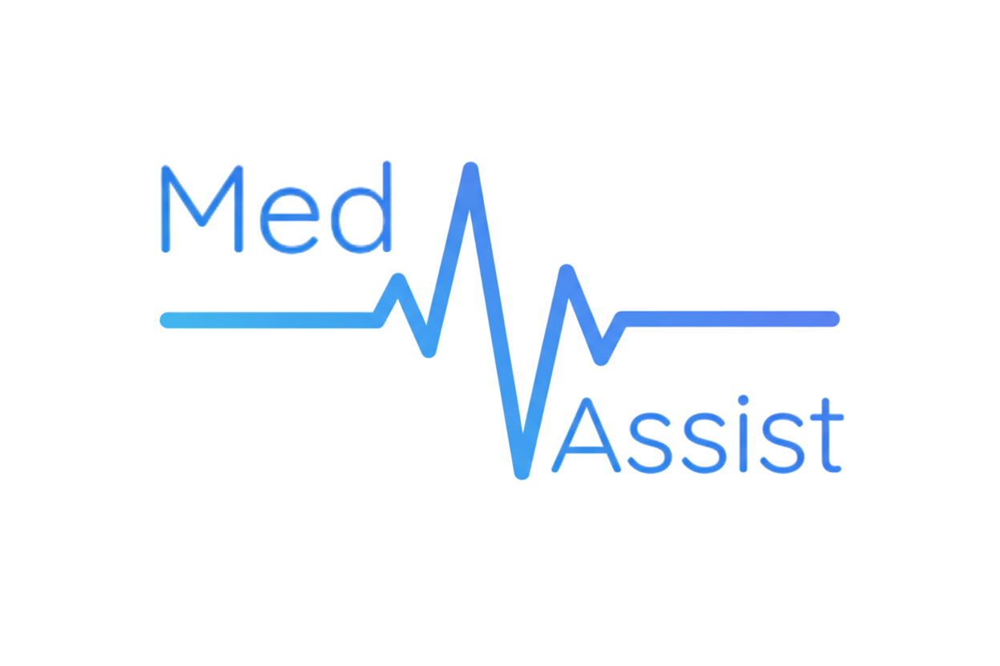

<div align="center">
  
</div>

# Med Assist

## Revolucionando la consulta médica. Menos teclado, más humanidad.

Med Assist es una solución de inteligencia artificial que transcribe y redacta informes médicos a partir de las conversaciones entre médico y paciente, permitiendo a los doctores centrarse en lo que más importa: sus pacientes.

## Características

*   **Transcripción en tiempo real:** Convierte la conversación en texto de forma instantánea.
*   **Extracción de entidades clínicas:** Identifica y extrae términos médicos clave.
*   **Generación de informes preliminares:** Crea un borrador del informe clínico estructurado.

## Cómo empezar

**Requisitos:** Node.js

1.  **Instalar dependencias:**
    ```bash
    npm install
    ```

2.  **Ejecutar la aplicación:**
    ```bash
    npm run dev
    ```
    La aplicación estará disponible en `http://localhost:3000`.

## Contribuciones

¡Estamos abiertos a contribuciones! Si deseas contribuir, por favor abre un "issue" para discutir tus ideas.
